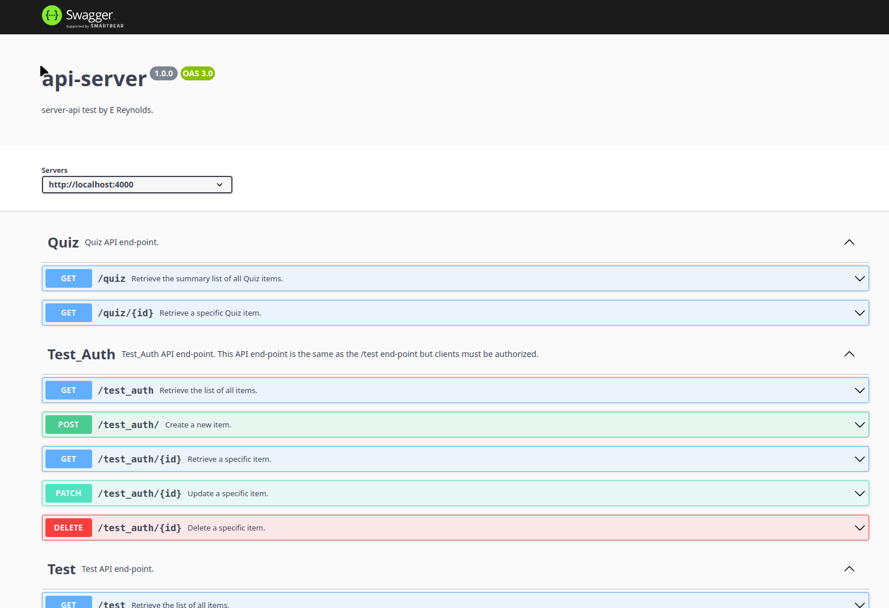

# API-SERVER

REST API server written with..

* Node JS framework
* Javascript
* Express
* swagger-jsdoc for creating the swagger docs.
* swagger-ui-express for creating a swagger interface/test route.

# REQUIRED

* [git](https://git-scm.com/install/)

* [node](https://nodejs.org/en)  
  NOTE: You will need node version 20.

* [MongoDB](https://www.mongodb.com/)  
  NOTE: YOu do not need mongoDB if you are only using the server for quiz api.

* [nodemon](https://www.npmjs.com/package/nodemon)  
  `npm i nodemon`

# CHECK-OUT THE REPO

```bash
mkdir api-server
cd api-server && git clone https://github.com/ewen-r/api-server.git .
```

# INIT

```bash
cd api-server
npm i
```

# CREATE .env FILE

```bash
cd api-server
touch .env
echo "MONGO_URI=your_mongodb_connection_string" >> .env
echo "ACCESS_TOKEN_SECRET=your_access_token_secret" >> .env
echo "REFRESH_TOKEN_SECRET=your_refresh_token_secret" >> .env
```

# START THE SERVER 

## Start the server in Dev mode

```bash
npm run start:dev
```

Open your web browser at [http://localhost:4000](http://localhost:4000) and you should see the documentation page.  


## Server Details

Default Port: 4000 (configurable via environment)  
Main Entry: app.js  
API Documentation: Available at http://localhost:4000/api-docs  
Root Route: Redirects to API documentation
The server automatically detects if it's running locally (loads .env) or in production (uses environment variables directly).

## Endpoints

* /
  * Redirects to /api-docs.
* /api-docs
  * Documentation and user interfaces.
* /test
  * Dummy data for testing purposes.
* /test_auth
  * Dummy data for testing purposes. Requires authorisation.
* /user
  * Register, login, logout interfaces for managing authentication.
* /quiz
  * Interfaces for managing quizzes.

## /

Redirects to /api-docs

## /api-docs

Documentation and user interfaces.

## /test

Dummy data for testing purposes.
Implements a few basic REST interfaces (see api-docs).

## /test_auth

Dummy data for testing purposes.
Implements a few basic REST interfaces (see api-docs).
Requires authenticated and authorised user credentials.

## /user

* Register a new user.
* Login for existing user.
* Logout.
* Refresh authentication token.

## /quiz

* Retrieve a summary list of quizzes.
* Retrieve a specific instance of quiz.

##
